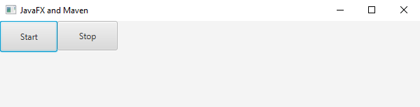
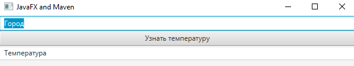
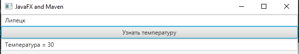

# MeteoServer
Метео сервер

**Описание**: Два приложения, одно является сервером и хранит данные о температуре в городах, второе является клиентом. Взаимодействие между ними осуществляется через socket.

**Стек технологий**:
- язык программирования Java.
- библиотека JavaFX.

**Статус**:
- Alpha 1.1.

**Скриншот сервера**:

**Скриншоты клиента**

## Конфигурация

Для работы требуется библиотека JavaFX.

## Использование

- Запустите сервер
- Нажмите кнопку Start
- Запустите клиент
- Введите город (Воронеж, Липецк, Москва, Киев)
- После ввода города, выведется температура этого города с сервера

## Тестирование продукта

Unit-тесты отсутствуют.

## Известные проблемы

Известных проблем нет.

## Обратная связь

Если у вас есть вопросы, проблемы, отчеты об ошибках и т. д., сообщите о проблеме в системе отслеживания проблем этого репозитория.

----

## Лицензии
1. [TERMS](TERMS.md)
2. [LICENSE](LICENSE)
